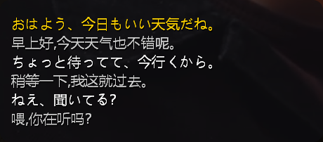

# Sakura Lyric Bar

**Character dialogue, pinned to your desktop like song lyrics.**

Read the conversation while you are watching a fullscreen video — no need to switch back to the main window just to catch a line.



> A plugin for [Sakura](https://github.com/Rvosy/Sakura) (Plugin API v4).

## What it does

A small always-on-top, draggable overlay window:

- Shows what the current character is saying — **source text and translation side by side** (bilingual / translation only / source only);
- **The line being spoken right now is highlighted** and follows the voice sentence by sentence; long replies scroll inside the bar;
- Hover the bar → an input box appears → click, type, **press Enter to send the message to the character**;
- Everything about its look is configurable: font size and family, text colors, background color, background opacity, overall opacity, corner radius, border, text outline and shadow;
- Remembers where you dragged it (multi-monitor aware).

## Install

1. Download `字幕栏.zip` from [Releases](../../releases/latest);
2. Sakura → **Settings → Plugins → More → Install from ZIP…**;
3. Find "字幕栏" in the list and turn on **Enable**;
4. Click **Apply** or **Save and close** in the settings footer.

The bar appears at the bottom center of your primary screen. Full configuration reference: [`docs/settings.md`](docs/settings.md) (Chinese).

## Known limitations

- **Windows only.** Built on Win32 layered windows and GDI; there is no cross-platform implementation.
- **Not visible on top of exclusive-fullscreen games** (borderless / fullscreen-windowed works fine). Exclusive fullscreen bypasses desktop composition, so ordinary windows cannot be drawn over it. Injecting into the game's render pipeline was deliberately avoided (anti-cheat risk).
- **"Hide when a fullscreen app is active" is ON by default** (designed for games). If you mainly use this while **watching fullscreen video**, turn that switch off in the plugin settings.
- **Messages sent from the bar's input box are not read aloud** (subtitles only). This is a host-side limitation: voice playback is driven by the desktop native layer, which only drives conversations it initiated; the `sakura.host.mobile` channel available to plugins does not receive the internal identifier needed to drive speech. Reported upstream as [issue #227](https://github.com/Rvosy/Sakura/issues/227). **Speak from the main window when you want audio — the bar still shows the subtitles.**

## Development

The source lives at the repository root — pure standard library, zero third-party dependencies (Win32 is called directly via `ctypes`).

```bash
# Run the tests (205+ cases, including contract tests)
python -m unittest discover -s tests -v

# Run the overlay standalone, without starting Sakura
python overlay.py --demo
```

Design document: [`docs-design.md`](docs-design.md) (Chinese).

## License

MIT
